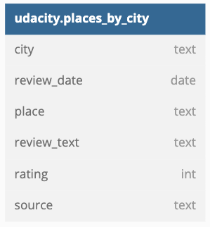
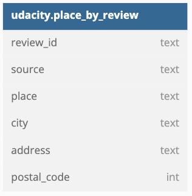

# Capstone Project

## Summary of the project

The purpose of this project is to identify and gather the dataset (at least two sources and more than 1 million rows) and use it to combine what I have learned throughout the Data Engineer Nanodegree program.
This project uses the Yelp and Tripadvisor dataset with 2 data sources: review datasource and business datasource to model Apache Cassandra database, build ETL pipeline and run data quality checks to ensure the pipeline ran as expected.

The project follows the follow steps:
Step 1: Scope the Project and Gather Data
Step 2: Explore and Assess the Data
Step 3: Define the Data Model
Step 4: Run ETL to Model the Data
Step 5: Complete Project Write Up

## Step 1: Scope the Project and Gather Data

A startup wants to analyze the data they are collecting from different sources. The data will come in various formats and in different models but it will concern one area, it will be data collected from websites allowing users to post reviews on restaurants, hotels and other facilities. The analysis team is particularly interested in understanding what are the opinions on different businesses. Currently, there is no easy way to query the data to generate the results.

The startup needs a data engineer to create an Apache Cassandra database for the analysis. The analytics team has provided queries they would like to run of different data sets.

## Step 2: Explore and Assess the Data

There are 2 different sources to analyze as for now:
The Yelp dataset - “it is a subset of our businesses, reviews, and user data for use in personal, educational, and academic purposes. Available as JSON files, use it to teach students about databases, to learn NLP, or for sample production data while you learn how to make mobile apps.”
Source: https://www.yelp.com/dataset
The Yelp dataset is 5,34 GB dataset divided into several files in JSON format. I will use file yelp_reviews.json and yelp_business.json that are about 1GB  and have more than 1 million of rows
Hotel Rviews - “a list of 1,000 hotels and their reviews provided by Datafiniti's Business Database. The dataset includes hotel location, name, rating, review data, title, username, and more”.
Source: https://www.kaggle.com/datasets/datafiniti/hotel-reviews
This datasource is a 238MB file in CSV format.

To explore the dataset I imported it to Jupyter Notebook to get an overview on these data sets . I cleaned it: new lines are removed from json, postal code’s are changed to be 5 character long and not numeric values are removed, date format is unified.

## Step 3: Define the Data Model

[20221218_232730_table1.png](assets/20221218_232730_table1.png)

## Step 4: Run ETL to Model the Data

Steps for running ETL model can be found in jupyter notebook.

Data Dictionary:

| column      | type | description                                          |
| ------------- | ------ | ------------------------------------------------------ |
| review_id   | text | the unique review id                                 |
| review_date | date | the date of the review, formatted YYYY-MM-DD         |
| source      | text | the source of the data, currently yelp or datafiniti |
| review_text | text | the review itself                                    |
| rating      | int  | the rating of the place associated with review       |
| place       | text | The reviewed place’s name                           |
| address     | text | the full address of the place                        |
| city        | text | the city of the reviewed place                       |
| postal_code | int  | the postal code of the reviewed place                |

## Step 5: Complete Project Write Up

Tools and Technologies
Python/Pandas for data analysis and processing
Cassandra for storing data.

Data Update Frequency
Tables can be updated whenever a new source is identified. All tables should be update in an append-only mode.

Future Design Considerations

If the data was increased by 100x.
Using Spark for data processing or AWS EMR distributed data cluster is needed.

If the pipelines were run on a daily basis by 7am.
Using Apache Airflow for running ETL data pipeline to regularly to append data.

The database needed to be accessed by 100+ people.
As cassandra has linear scalability, it is easy to add more nodes to the system so performance will increase linearly.
